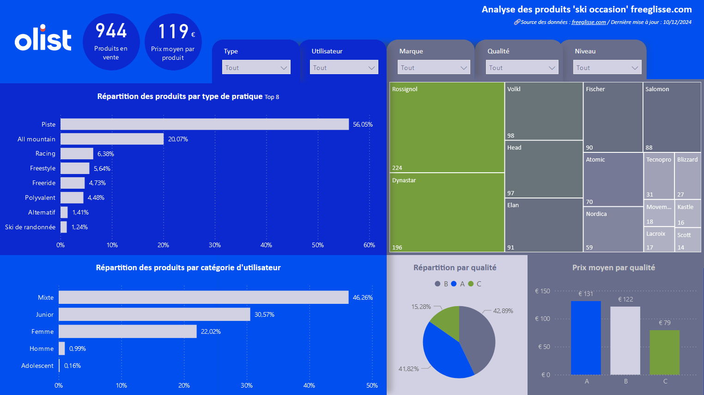

# Web scrapping and Power BI dashboarding project

# Context
[Freeglisse.com](https://freeglisse.com/fr/12-ski-occasion) positions itself as the leading second-hand ski resale website in France.
It offers an extensive catalog of equipment, categorized by type of use, quality, brand, etc.
Our objective is to analyze the products available for resale on the site to assess its positioning and product offerings. This initiative is being conducted in preparation for the acquisition of the site by a third-party company (Olist).

# Mission
To achieve this, we will first collect product information through web scraping with Python (using BeautifulSoup and Selectolax) and then analyze the gathered data using a Power BI dashboard.

> Note : This project is an exercise as part of a data analysis training program, designed to teach web scraping techniques with Python and to master dashboard design using Power BI.

# Web scraping
## Additional information
Since the products on freeglisse.com are categorized into three quality levels (A, B, and C), we perform web scrapping from the base URLs stored in the [config.py](config.py) file :
```python
BASE_URLS = {
    "A": "https://freeglisse.com/fr/12-ski-occasion/s-1/etat_du_materiel-qualite_a?page=",
    "B": "https://freeglisse.com/fr/12-ski-occasion/s-1/etat_du_materiel-qualite_b?page=",
    "C": "https://freeglisse.com/fr/12-ski-occasion/s-1/etat_du_materiel-qualite_c?page=",
}
```

## Instructions to run the scrapping script :
Clone this repository, create a virtual environment, and install dependencies :
```bash
git clone https://github.com/cyrilgrv/freeglisse-olist/
cd freeglisse-olist
python3 -m venv venv
source venv/bin/activate #Unix
venv\Scripts\activate #Windows 
pip install -r requirements.txt
python main.py
```

# Dashboard :
>Note : The data displayed in this demo dashboard was fetched on on October 12, 2024.

[](https://app.powerbi.com/view?r=eyJrIjoiODcxMDQzZWUtMmQ3Yy00OTI2LWJlZGMtNTljNGQ5ZjczZDUwIiwidCI6IjJkNjhkYjFhLTNmY2QtNDZjMi1iNDNiLTlhYjE4NjU1NzY1NyIsImMiOjEwfQ%3D%3D)

[](https://app.powerbi.com/view?r=eyJrIjoiODcxMDQzZWUtMmQ3Yy00OTI2LWJlZGMtNTljNGQ5ZjczZDUwIiwidCI6IjJkNjhkYjFhLTNmY2QtNDZjMi1iNDNiLTlhYjE4NjU1NzY1NyIsImMiOjEwfQ%3D%3D)

## Tools Used

[](https://code.visualstudio.com/)


## Libraries Used
[](https://github.com/pandas-dev/pandas)
[](https://github.com/psf/requests)
[](https://www.crummy.com/software/BeautifulSoup/)
[](https://github.com/rushter/selectolax)
[](https://github.com/tqdm/tqdm)
